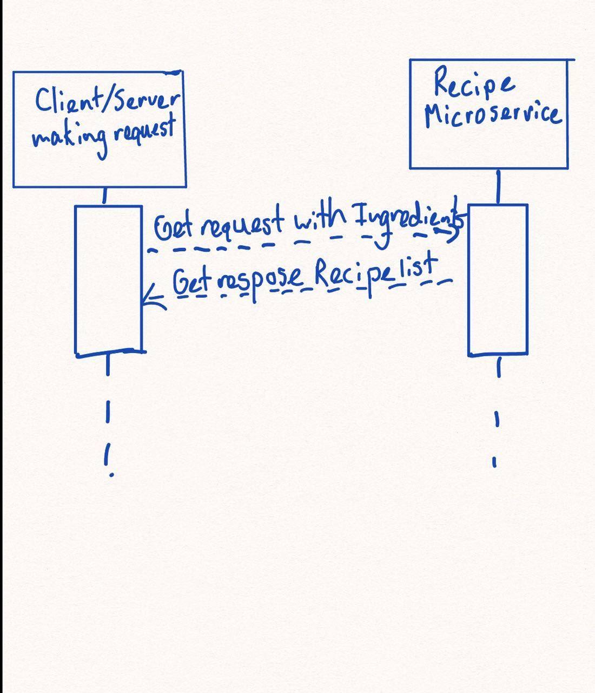

Title: Recipe Recommendation Microservice

Description: 
This project is a recipe recommendation microservice which receives a list
of ingredients in a get request and sends back a JSON object of recipes listed in descending overlap with the ingredient list.

Intended Use:
This microservice is intended to be used by some application where food ingredients are stored to make relevant recipe recommendations.

Communication Contract:
    I certify that even if other details of the microservice may change that the requests to 
    this service can always be made using request parameters and that the responses will always be a JSON object of ranked recipes.

    
Instructions:
    - Requesting Data
    In order to receive the data from this microservice a get HTTP request must be made to 
    the chosen port where the server is running. The ingredients selected must be seperated by commas in the URL. The port used is 4000 by default and can be changed. Alternatively the microservice can be hosted on some other web URL of chioice.

    Example Request: localhost:4000/bread,butter

    - Receiving Data
    The response of the microservice to a request is sent back as a JSON object to the 
    URL tha requested it. 

CSV Data : https://www.kaggle.com/datasets/irkaal/foodcom-recipes-and-reviews

UML Diagram:
